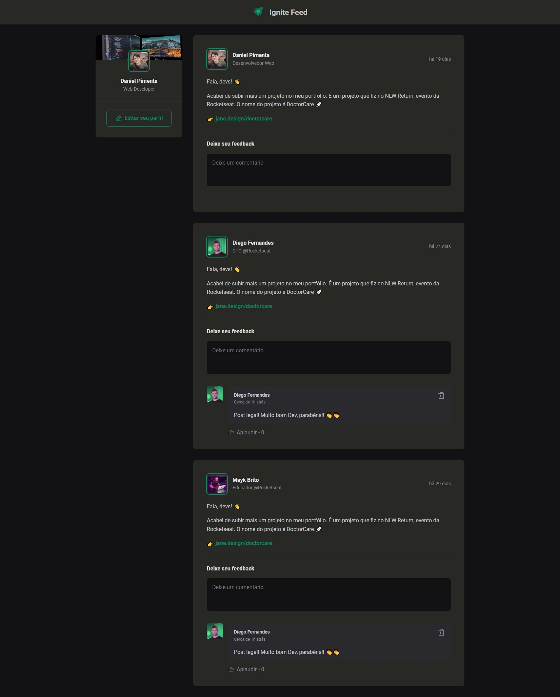
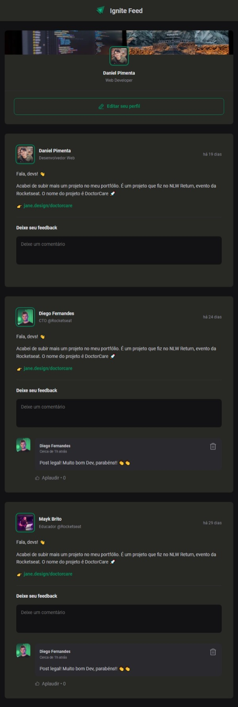
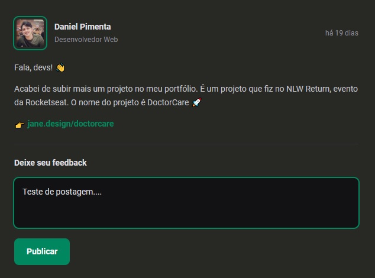

 

<h1>Ignite Feed</h1>

> Simulação de página de um blog com design responsivo.

* Site front-end construído em ReactJS com TypeScript;

* Área com botão de alteração de dados do perfil;

* Postagens dos usuários;

* Comentários dos usuários;

* Botão "Publicar" ativado quando o "textarea" é acessado e digitado.

 

